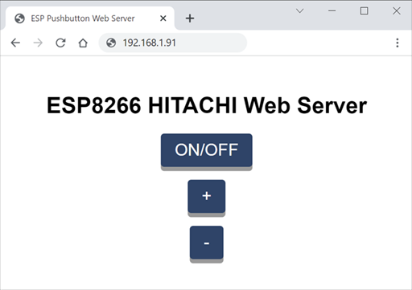

# MagicWandMod
Simple modification to get your "European Magic Wand" to the next IOT-level.

## Introduction
Wouldn't it be cool to remote control more and more devices via online webinterfaces?
I decided to have a go at this magic wand. With some help it turned out to be reasonably easy.
With this mod you can switch the wand on or off and regulate the speed via a webbased interface.
Bringing this ancient artifact to the new era of IOT.

## Disassemble
First remove 3 "hidden" philips screws.
### Top Screw

Bend the big white head a bit and unscrew this this tiny screw. You need to twist the ring so it will loosen.

### Back Screw

Carefully remove the sticker (not like I did) and unscrew

### Front Screw

With a tiny screwdriver bent the silicon panel until you can reach the screw there.

Loosen the screw of the PCB. The big 230V components are on the side you can see.
All the micro controller stuff is on the backside. Be carefull there is a tiny ribbon of the buttons in a miniscule connector.
Lift the black part of this connector and the ribbon will come out (have fun putting it back in place later)

## Hacking the buttons
There is a semi-professional way of hacking the control of this Wand. I found some useful information on @furrtek his repository.
Taking the easy approach was more fitting for this experiment:grinning:

### Power Pads
on the back of the PCB you can find several test pads. Here is where I hooked into the power circuit:

### Button Pads
The first idea was to solder on the connector pins, but my soldering skills aren't that advanced. Instead it turned out the small pad's
near the connector are exactly those button signals. 

I used flexible wire [28AWG](https://www.aliexpress.com/item/1005001609786868.html) from ali-express.

## Adding Smart-Hardware.

Here you can see the first tests in my super clean workshop.
This scematic got everything up and running:

The signals from the Magic Wand are pulled up to 5V. Be careful. Don't connect these directly to your ESP board, or you will fry it.
Such boards can handle 3,3V signals max. For this experiment I have used this [module](https://www.wemos.cc/en/latest/d1/d1_mini_lite.html).
The mosfet's used are [IRLZ34N](https://www.tinytronics.nl/shop/en/components/mosfets-fets/irlz34n-power-mosfet-55v-30a) these can more or less work with the 3.3V from this microcontroller.

## Bill of Materials
* 1x [Europe Magic Wand](https://www.bol.com/nl/nl/p/europe-magic-wand-clitoris-vibrator-massager-31-cm-stimulatiekop-6-cm/9200000012144020/?s2a=)
* 1x [BreadBoard](https://www.tinytronics.nl/shop/en/tools-and-mounting/prototyping-supplies/breadboards/breadboard-400-points)
* 1x [ESP2688 board](https://www.tinytronics.nl/shop/en/development-boards/microcontroller-boards/with-wi-fi/wemos-d1-mini-v4-esp8266-ch340) ordering 2 is smart. Usually few are killed before the end of a project.
* 3x [IRLZ34N](https://www.tinytronics.nl/shop/en/components/mosfets-fets/irlz34n-power-mosfet-55v-30a) mosFET's
* 3x [10kohm](https://www.tinytronics.nl/shop/en/components/resistors/resistors/10k%CF%89-resistor-(standard-pull-up-or-pull-down-resistor)) weerstand
* 1x [28AWG Wires](https://www.aliexpress.com/item/1005001609786868.html) via ali-express
* 2x [DuPont jumper wires](https://www.tinytronics.nl/shop/en/cables-and-connectors/cables-and-adapters/prototyping-wires/dupont-compatible-and-jumper/dupont-jumper-wire-male-male-10cm-10-wires) or more.
* 1x [micro USB port](https://www.tinytronics.nl/shop/en/cables-and-connectors/connectors/usb/micro-usb-2.0-female-to-dip-adapter)
* 1x [micro USB plug](https://www.aliexpress.com/item/1005002362150113.html) via ali-express.

## Too lazy to integrate inside the magic wand
I could probably integrate everyting on a tiny PCB and put it all inside the Wand. 
sadly this was not the case and a [micro USB](https://www.tinytronics.nl/shop/en/cables-and-connectors/connectors/usb/micro-usb-2.0-female-to-dip-adapter) connector was used. 

I am waiting for a connector and hope it has 5 outputs as well. Most standard cables don't have the IO pin connected. 

## Software
The software that was used can be found in this repository. Check the info inside the software to find the original code.
These humans have learned me so much about ESP's. 

[x] Add pictures and description
[x] Add BOM.
[ ] Add Video result.
[ ] Make prototype with ESP-01S.
[ ] Create 3D printed supports for this Magic unit.
[ ] Write software to use the BLYNK interface:tada:
