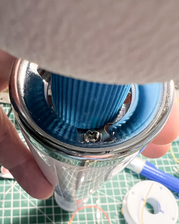
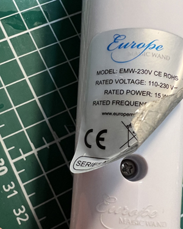
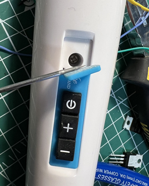
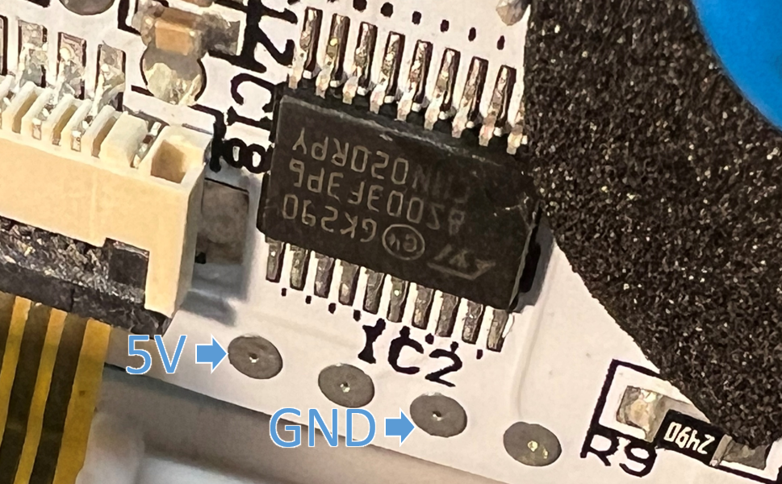
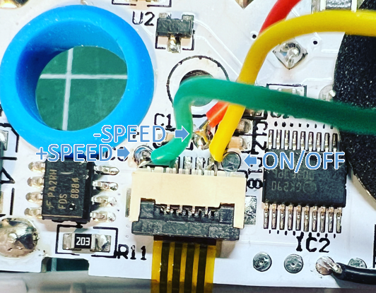
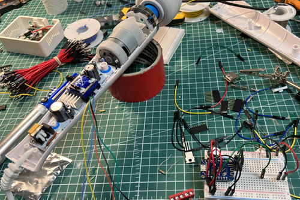
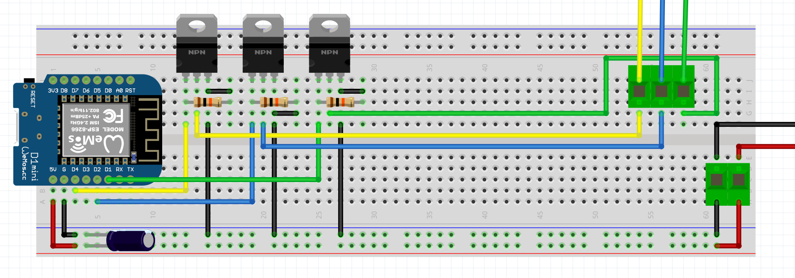
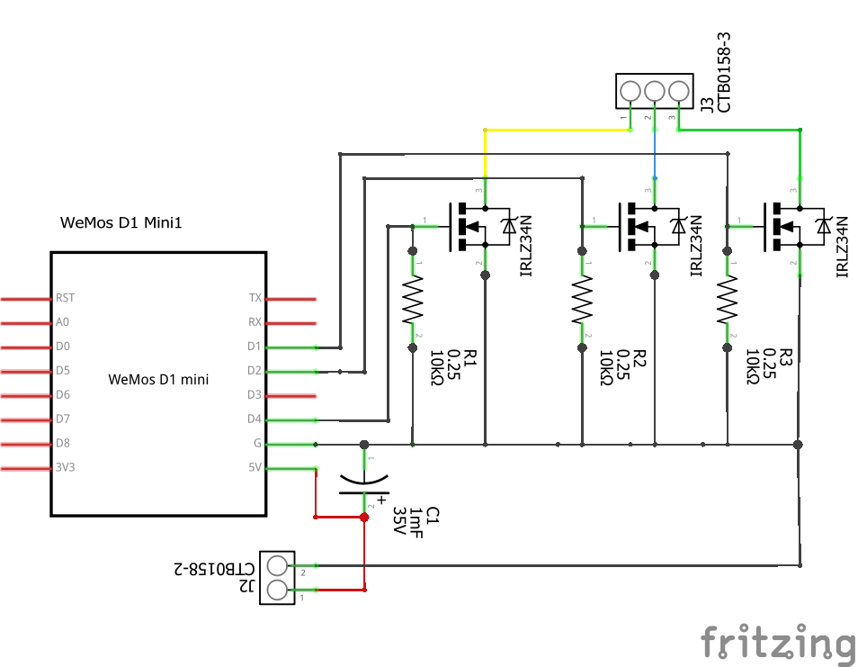
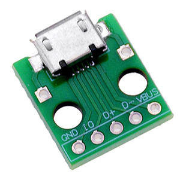
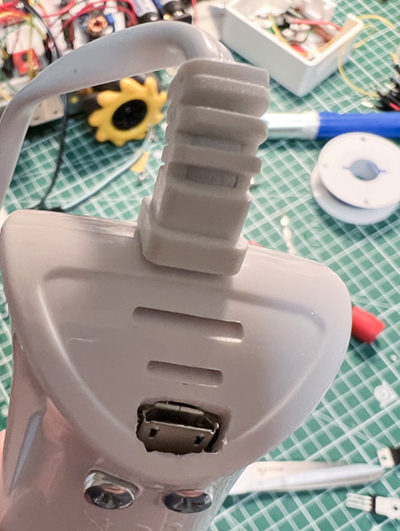

# MagicWandMod
Simple modification to get your "European Magic Wand" to the next IOT-level.

## Introduction
Wouldn't it be cool to remote control more and more devices via online webinterfaces?
I decided to have a go at this magic wand. With some help it turned out to be reasonably easy.

## Disassemble
First remove 3 "hidden" philips screws.
### Top Screw

Bend the big white head a bit and unscrew this this tiny screw. You need to twist the ring so it will loosen.

### Back Screw

Carefully remove the sticker (not like I did) and unscrew

### Front Screw

With a tiny screwdriver bent the silicon panel until you can reach the screw there.

Loosen the screw of the PCB. The big 230V components are on the side you can see.
All the micro controller stuff is on the backside. Be carefull there is a tiny ribbon of the buttons in a miniscule connector.
Lift the black part of this connector and the ribbon will come out (have fun putting it back in place later)

## Hacking the buttons
There is a semi-professional way of hacking the control of this Wand. I found some useful information on @furrtek his repository.
Taking the easy approach was more fitting for this experiment:grinning:

### Power Pads
on the back of the PCB you can find several test pads. Here is where I hooked into the power circuit:

### Button Pads
The first idea was to solder on the connector pins, but my soldering skills aren't that advanced. Instead it turned out the small pad's
near the connector are exactly those button signals. 

I used flexible wire [28AWG](https://www.aliexpress.com/item/1005001609786868.html) from ali-express.

## Adding Smart-Hardware.

Here you can see the first tests in my super clean workshop.
This scematic got everything up and running:

## Too lazy to integrate inside the magic wand
I could probably integrate everyting on a tiny PCB and put it all inside the Wand. 
sadly this was not the case and a [micro USB](https://www.tinytronics.nl/shop/en/cables-and-connectors/connectors/usb/micro-usb-2.0-female-to-dip-adapter) connector was used. 

I am waiting for a connector and hope it has 5 outputs as well. Most standard cables don't have the IO pin connected. 

## Software
The software I used can be found [here](https://randomnerdtutorials.com/esp32-esp8266-web-server-outputs-momentary-switch/)! (you need to add a few lines of code yourself but if you got this far that won't be a big problem either)

