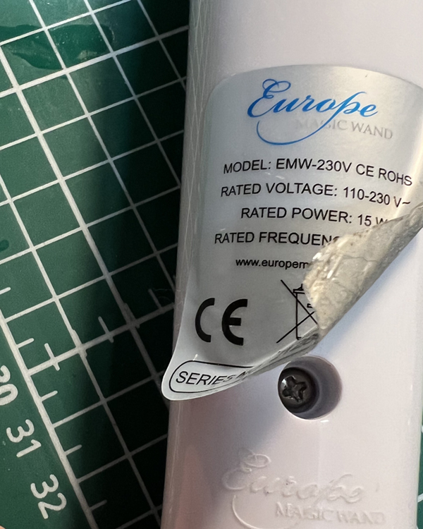

# MagicWandMod
Simple modification to get your "European Magic Wand" to the next IOT-level.

## Introduction
Wouldn't it be cool to remote control more and more devices via online webinterfaces?
I decided to have a go at this magic wand. With some help it turned out to be reasonably easy.

## Disassemble
You need to remove 3 "hidden" philips screws.
### Top Screw

Bend the big white head a bit and unscrew this this tiny screw. You need to twist the ring so it will loosen.

### Back Screw

Carefully remove the sticker (not like I did) and unscrew

### Front Screw

With a tiny screwdriver bent the silicon panel until you can reach the screw there.

